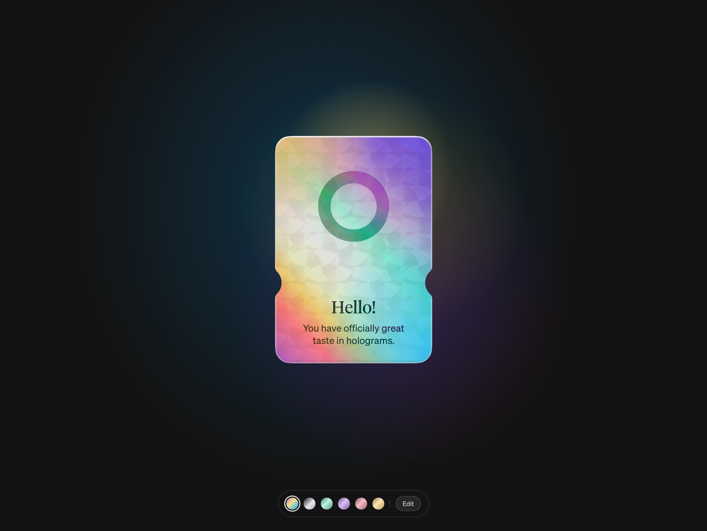

# FlashCard ⚡

A single-page holographic ticket card with a springy pop-in entrance,
pointer-tracked 3D tilt, iridescent foil material, and live theming —
run it locally with one command.



> 灵感来源 / Inspired by **[Elyx](https://elyx.design/)**
>
> The ticket card is extracted from Elyx's private-beta signup dialog
> （"Thanks!" 票据卡）, reusing its original CSS, animation controller and
> foil/guilloché assets, then rebuilt as a standalone, customizable page.
> All card visuals, code and font files originate from
> [elyx.design](https://elyx.design/) — credit and appreciation to the
> Elyx team for the gorgeous design. This project is for learning and
> personal enjoyment; please respect the original creators' rights.

## Features

- **Pop-in entrance** — the card springs out from the center with a
  soft overshoot (~0.9s) after a short dark beat
- **3D pointer tracking** — tilt, rainbow shift and foil highlights
  follow your cursor in real time
- **6 skins** — Aurora / Onyx Silver / Emerald / Amethyst / Rose /
  Amber, switchable from the bottom bar with a shine sweep
- **Live editing** — the `Edit` panel lets you upload a custom logo
  (drag & drop supported) and rewrite the card title/text on the fly
- **Persistence** — skin, logo and text are stored in `localStorage`

## Quick start

```bash
cd flashcard
python3 serve.py        # or any static server, e.g. `python3 -m http.server 8477`
```

Open **http://127.0.0.1:8477/thanks.html** — that's it. Refresh to
replay the entrance animation.

## Customization

- **Skins** — click the color dots in the bottom bar; each skin is a
  `--card-colors` gradient override in `thanks.html` (keeps the live
  `--rainbow-*` variables, so foil shimmer survives re-theming)
- **Logo** — `Edit → upload` (square transparent-background SVG works
  best); it is masked with the foil material automatically. Or replace
  `_astro/logo.svg` directly
- **Text** — `Edit → Title / Text`; press Enter in `Text` for a line
  break on the card
- **Card copy / colors** — see the `data-foil-text` attributes and the
  override `<style>` block inside `thanks.html`
- **Logo size** — the `.ticket-mark` override (currently +10%) in the
  same style block

## How it works

`thanks.html` is self-contained: the ticket DOM is extracted verbatim
from the original page, the original `signupTicket.js` controller drives
the entrance/tilt/sweep animations (triggered by dispatching the same
`signup:statechange` event the real signup flow emits), a tiny WebGL
aurora module is disabled in favor of the CSS `.ticket-glow`, and a
short bootstrap script wires up skins, the edit panel and persistence.

## Project structure

```
thanks.html   — the page (card DOM + override styles + bootstrap script)
serve.py      — zero-dependency static server (stdlib only)
_astro/       — original controller JS, CSS, fonts and ticket assets
favicon.svg   — tab icon
```

## Thanks

- [Elyx](https://elyx.design/) — for the inspiration and the beautiful
  ticket-card design this project builds upon
